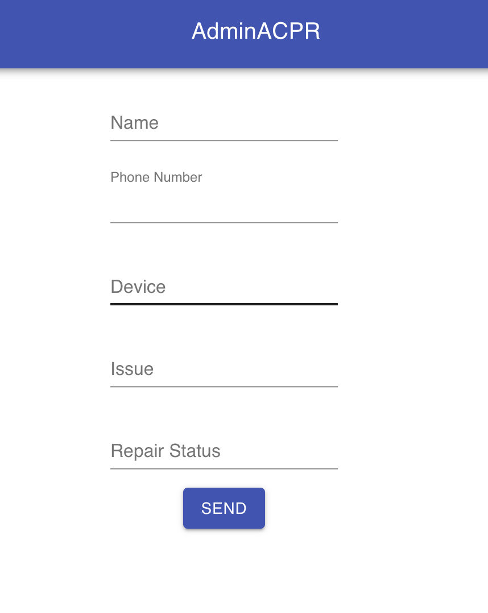

  <h3>
    An Adminastration Page to manage the phones you have to repair and/or repaired.
  </h3>
  

    Here we can check in guests who need their devices repaired. We can see the date they were added, the owner name of the device, their number, the name of the device, the issue, and the status of the repair. We can update the status of the device. Future improvements would be to notify the guest everytime the status of their device is updated. This was made in React.
  

  

    <a href='https://brave-lamport-9acdc6.netlify.com/'>
      Demo
    </a>
  

  

    <a href='https://github.com/Midlu/AdminACPRReact'>
      Backend Repo
    </a>
  

  

    <a href='https://github.com/Midlu/AdminACPRReactFrontend'>
      Frontend Repo
    </a>
  

  
  

