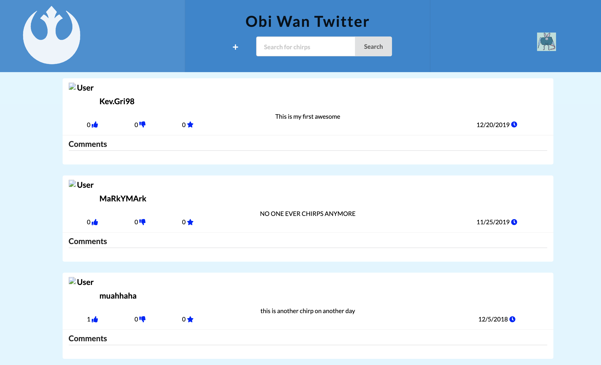
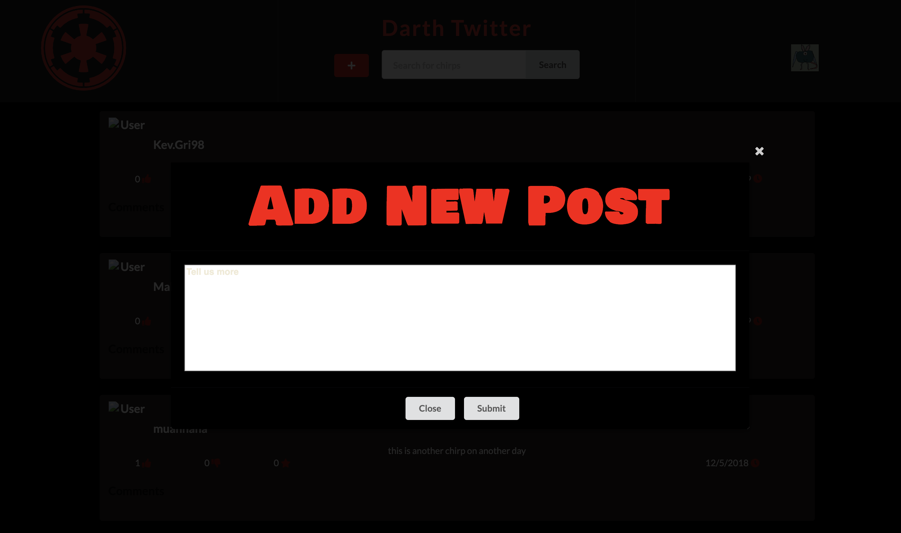
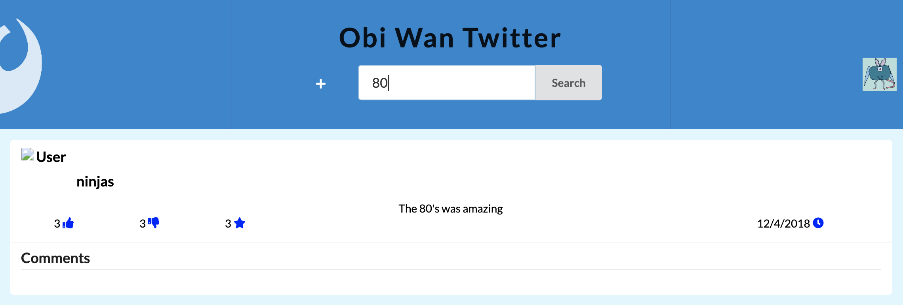

  <h3>
    Working as a team at a internship held by IntraEdge, we made a twitter like website called Chirpy.
  </h3>
  

    It was interesting working on as the frontend team. We accomplished quite a bit, users can log in, make chirps, like, hate, and favorite them. We ran into setbacks like changing frameworks, refactoring some of the codebase, deciding how we wanted to structure the data. We also were testing as we went along. It is interesting to see how things are deeply connected when you try to isolate and test them.
  

  

    <a href='http://kllll.s3-website-us-west-1.amazonaws.com/login'>
      Demo
    </a>
  

  

    <a href='https://github.com/bytesizedxyz/nov-project-chirp-backend'>
      Backend Repo
    </a>
  

  

    <a href='https://github.com/bytesizedxyz/nov-project-chirp-frontend'>
      Frontend Repo
    </a>
  

  

    Along the way, we managed to integrate a theme switch. Learning how to go from the Dark Side to the Light Side was an interesting experience. 
  

