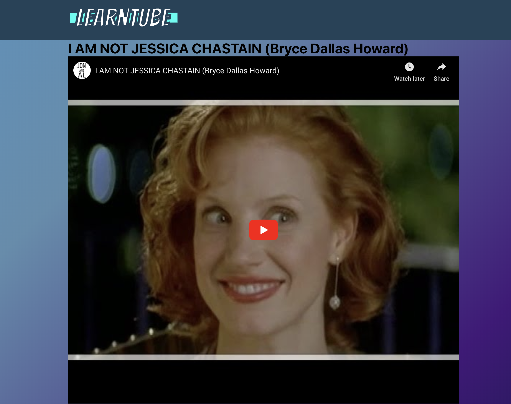

  <h3>
    Working as a team at a internship held by IntraEdge, we made a youtube like website called Learntube.
  </h3>
  

    Now having experienced working on a team, we switched roles, with the frontend as the backend and the backend as the frontend. It wasn't as difficult testing the backend once we started seperating everything out into their own functions. It was very straightforward work. The only difficulties we had we with the frontend needing help to finish because of difficulty understanding the technologies being implemented. Towards the end, we managed to get a MVP by the deadline of the project.
  

  

    <a href='https://angry-euclid-4e89b9.netlify.com/'>
      Demo
    </a>
  

  

    <a href='https://github.com/bytesizedxyz/dec-project-learntube'>
      Repo
    </a>
  
  

  

