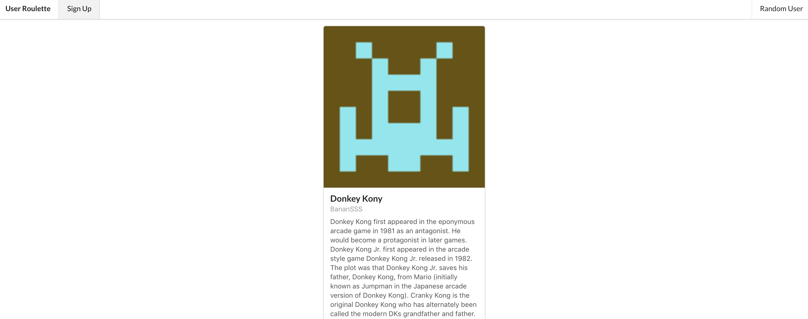
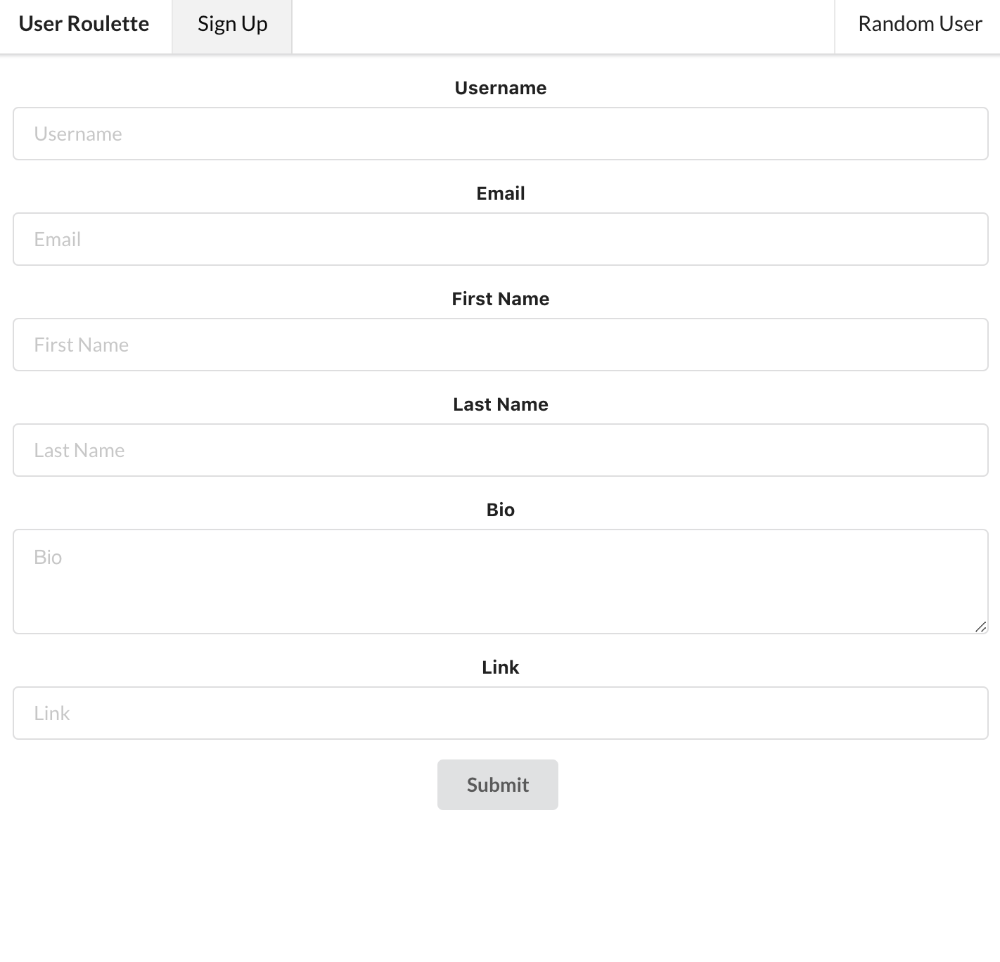

  <h3>
    In this project at the IntraEdge internship, we made a mini-project within the span of two days to get some MVP out that the entire group would end up working on.
  </h3>
  

    There was no designated Frontend/Backend team. This was to make up for time lost learning on the frontend part during the Learntube project. We have a feautured user on the home page that changes every hour. There is a random user that you can look at by clicking on the random user button.
  

  

    <a href='https://inspiring-pare-aca877.netlify.com/'>
      Demo
    </a>
  

  

    <a href='https://github.com/bytesizedxyz/userroulette-backend'>
      Backend Repo
    </a>
  

  

    <a href='https://github.com/bytesizedxyz/userroulette-frontend'>
      Frontend Repo
    </a>
  

